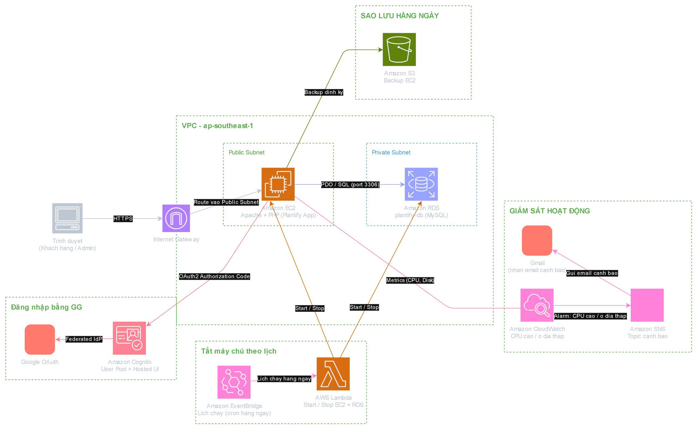

Tại phần này, bạn cần tóm tắt các nội dung trong workshop mà bạn **dự tính** sẽ làm.

# Plantify Co — Nền tảng thương mại điện tử được vận hành an toàn trên AWS
## Triển khai website bán cây cảnh PHP với đăng nhập liên kết, sao lưu tự động và giám sát hệ thống

### 1. Tóm tắt 

Plantify Co là website bán cây cảnh và cộng đồng cho người yêu cây xanh, xây dựng trên nền ứng dụng PHP MVC tự viết (PDO + MySQL) vốn đã có sẵn template qua các dự án cá nhân. 

Mục tiêu của dự án thực tập không phải là xây dựng ứng dụng Cloud-Native ( dự án phải triển khai song hành với đẩy lên cloud ) mà là phát triển nhanh chóng dựa trên nền tảng mã nguồn mở (Framer Motion, srtdash, E-commerce UI Kit) và kiến trúc phần mềm có sẵn đưa nó từ trạng thái "code chạy trên máy cá nhân" thành một **dịch vụ cloud được vận hành đúng chuẩn**: chạy trên EC2, dùng RDS làm database quản lý, bảo vệ bằng IAM role theo nguyên tắc least-privilege, tự động sao lưu lên S3, giám sát bằng CloudWatch Alarm, và bảo mật đăng nhập bằng Amazon Cognito kết hợp Google OAuth cùng xác thực hai lớp TOTP dành riêng cho tài khoản admin. 

Kết quả là một hệ thống nhỏ nhưng có hình dáng thực tế của môi trường production — đúng kiểu hạ tầng mà một cửa hàng nhỏ thật sự sẽ vận hành — được xây dựng và triển khai thủ công trong khoảng thời gian 8 tuần.

### 2. Phân tích vấn đề
*Vấn đề hiện tại*
Ứng dụng Plantify ban đầu chỉ chạy như mã PHP cục bộ, không có hạ tầng cloud: không có database được quản lý, không sao lưu tự động, không giám sát, và hệ thống đăng nhập chỉ dừng ở form username/password thông thường, không có lớp xác thực thứ hai — nghĩa là chỉ cần lộ 1 mật khẩu admin là có thể chiếm toàn bộ cửa hàng. Ngoài ra, cũng không có quy trình triển khai hay khôi phục nào được ghi lại rõ ràng nếu server gặp sự cố.

*Giải pháp*
Đưa ứng dụng lên một kiến trúc AWS tối giản nhưng thực tế: **EC2** chạy ứng dụng PHP thông qua tên miền DuckDNS, **RDS (MySQL)** thay thế database cục bộ, **IAM role** (không dùng access key tĩnh) cấp cho EC2 đúng những quyền cần thiết, **S3** lưu bản sao lưu database hàng ngày được kích hoạt tự động qua cron, và **CloudWatch + SNS** cảnh báo khi CPU tăng bất thường, dung lượng trống RDS thấp, hoặc số kết nối RDS tăng đột biến. Bên cạnh đó, hệ thống đăng nhập được nâng cấp từ form thông thường lên **Amazon Cognito với Google làm nhà cung cấp danh tính liên kết (federated identity provider)**, và riêng tài khoản admin được bảo vệ thêm bằng **xác thực hai lớp TOTP**, để việc lộ mật khẩu Google một mình không đủ để truy cập bảng điều khiển admin. Ngoài ra, tránh "đốt tiền" vào giờ thấp điểm nhất 0h-7h sẽ có **Lambda** liên kết với **EventBride** bật tắt tài nguyên tự động ( bù trừ hạn chế của EC2 so với Serverless )

*Lợi ích và hoàn vốn đầu tư*
Dự án tạo ra một kiến trúc tham khảo thực tế cho việc triển khai ứng dụng PHP/MySQL lên AWS "đúng cách" — IAM least-privilege, sao lưu tự động, giám sát có cảnh báo, và xác thực nhiều lớp — thay vì lối tắt phổ biến là chạy trên 1 VPS không giám sát với SSH root và mật khẩu tĩnh. Nó giảm rủi ro vận hành (không còn phải băn khoăn "backup có chạy thật không?"), giảm mức độ ảnh hưởng khi mật khẩu bị lộ nhờ 2FA, và tạo ra một quy trình triển khai có tài liệu, có thể lặp lại nếu mất instance. Chi phí vận hành được giữ ở mức gần như miễn phí nhờ tận dụng AWS Free Tier (EC2 loại t, RDS instance nhỏ, vài CloudWatch alarm, dung lượng S3 chỉ vài chục KB mỗi bản backup), giúp hệ thống có thể duy trì lâu dài sau khi kỳ thực tập kết thúc.

### 3. Kiến trúc giải pháp
Nền tảng chạy trên một kiến trúc AWS đơn giản: người dùng truy cập ứng dụng PHP trên EC2 qua tên miền DuckDNS; ứng dụng đọc/ghi vào database MySQL trên RDS; một cron job trên EC2 thực hiện `mysqldump` (kèm `--single-transaction` để đảm bảo ảnh chụp dữ liệu nhất quán) rồi tải kết quả lên S3 thông qua IAM role gắn sẵn cho instance (không nhúng access key trong code); CloudWatch thu thập metric của EC2 và RDS, và thông qua một SNS topic, gửi email cảnh báo cho nhóm khi CPU, dung lượng RDS, hoặc số kết nối RDS vượt ngưỡng đã đặt. Việc xác thực cho cả thành viên và admin được xử lý qua Cognito Hosted UI, liên kết với Google làm identity provider; riêng tài khoản admin phải đi qua thêm một bước xác minh TOTP trước khi được cấp phiên đăng nhập có quyền cao.

### Dịch vụ AWS sử dụng
- **Amazon EC2**: Chạy ứng dụng PHP MVC (Plantify Co) và cron job sao lưu.
- **Amazon RDS (MySQL)**: Database quan hệ được quản lý, lưu sản phẩm, đơn hàng, người dùng, bình luận, tin tức và nội dung FAQ.
- **Amazon S3**: Lưu bản sao lưu database hàng ngày, có gắn timestamp, được tạo tự động.
- **AWS IAM**: Cung cấp role theo nguyên tắc least-privilege gắn cho EC2 (không dùng access key tĩnh) để truy cập S3.
- **Amazon CloudWatch + Amazon SNS**: Giám sát CPU của EC2, dung lượng trống và số kết nối của RDS; gửi cảnh báo qua email.
- **Amazon Cognito**: Xử lý xác thực và phiên đăng nhập/token, liên kết với Google OAuth.
- **Google Cloud OAuth Client**: Nhà cung cấp danh tính cho tính năng "Đăng nhập bằng Google".
- **EventBride + Lambda**: Tự động hóa tắt EC2 và RDS theo lịch

### Thiết kế thành phần
- **Ứng dụng web (EC2)**: Ứng dụng PHP MVC tự viết — gồm Controllers, Core (middleware Auth, PDO Database singleton, đọc Env, Helpers), Models và Views — phục vụ trang bán hàng, dashboard thành viên và bảng admin.
- **Database (RDS)**: Lưu sản phẩm, đơn hàng (được tạo qua transaction SQL sau khi kiểm tra lại giá ở server), người dùng, bình luận (có trạng thái kiểm duyệt pending/approved/hidden), tin tức, FAQ và nội dung trang.
- **Pipeline sao lưu (EC2 → IAM → S3)**: Cron job theo lịch (`0 2 * * *`) chạy `mysqldump --single-transaction`, lưu file `.sql` có timestamp, rồi tải lên S3 thông qua IAM role của instance.
- **Giám sát (CloudWatch → SNS)**: Alarm trên `CPUUtilization` (EC2), `FreeStorageSpace` và `DatabaseConnections` (RDS) gửi thông báo qua email tới nhóm bằng SNS topic.
- **Xác thực (Cognito ↔ Google ↔ EC2)**: Trình duyệt được chuyển hướng qua Cognito Hosted UI sang Google để đăng nhập; Cognito đổi authorization code lấy token ở phía server; ứng dụng PHP xác minh JWT, đọc nhóm người dùng, và — chỉ với Admin — yêu cầu thêm mã TOTP (secret lưu trong RDS, độc lập với tài khoản Google) trước khi cấp phiên đăng nhập có quyền cao.

### 4. Triển khai kỹ thuật
*Các giai đoạn triển khai*
Dự án trải qua 4 giai đoạn trong suốt kỳ thực tập:
- Rà soát mã nguồn PHP/MySQL sẵn có của Plantify và thiết kế kiến trúc AWS mục tiêu 
- Dựng hạ tầng lõi — EC2, RDS, IAM role, tên miền DuckDNS — và đưa ứng dụng chạy trên cloud lần đầu tiên 
- Bổ sung các tính năng vận hành và bảo mật — sao lưu tự động S3 qua cron, CloudWatch alarm với thông báo SNS, và xác thực Cognito + Google + TOTP 
- Debug, gia cố và viết tài liệu — xử lý các sự cố tích hợp thật (lỗi OAuth scope, thiếu identity provider, bug SQL binding), sau đó viết tài liệu kiến trúc và hướng dẫn triển khai 

*Yêu cầu kỹ thuật*
- **Tầng ứng dụng**: PHP 8.x với các extension `pdo_mysql`, `fileinfo`, `mbstring`; MySQL/MariaDB; Apache có `mod_rewrite`.
- **Tầng hạ tầng**: Sử dụng thực tế EC2 (cấu hình instance, security group), RDS (cấu hình endpoint, dung lượng lưu trữ), S3 (bucket policy, truy cập qua IAM role thay vì access key), và CloudWatch/SNS (metric alarm, đăng ký nhận email).
- **Tầng danh tính**: Cognito User Pool với Google làm federated identity provider (cấu hình đúng `redirect_uri` và `SupportedIdentityProviders`), cùng secret TOTP tự sinh cho từng admin, lưu trong RDS và xác minh ở phía server.

### 5. Lộ trình & Mốc triển khai
*Lộ trình dự án (8 tuần)*
- Tuần 1–2: Nghiên cứu nền tảng cloud và rà soát mã nguồn Plantify sẵn có.
- Tuần 3–4: Dựng EC2 và RDS; triển khai ứng dụng lần đầu; cấu hình IAM và DuckDNS.
- Tuần 5: Xây dựng pipeline sao lưu S3 và tự động hóa bằng cron.
- Tuần 6: Tích hợp Cognito, Google OAuth và xác thực hai lớp TOTP cho admin.
- Tuần 7: Debug các sự cố tích hợp thực tế (lỗi OAuth `invalid_scope`, thiếu identity provider, lỗi SQL bind) và cấu hình CloudWatch alarm qua SNS.
- Tuần 8: Hoàn thiện tài liệu, sơ đồ kiến trúc, viết blog chia sẻ kiến thức và triển khai trang báo cáo Hugo.

### 6. Ước tính ngân sách
Tất cả dịch vụ sử dụng đều nằm trong AWS Free Tier hoặc chi phí gần như bằng 0 ở quy mô của dự án này (1 EC2 instance nhỏ, 1 RDS instance nhỏ, dung lượng S3 chỉ vài chục KB mỗi bản backup hàng ngày, và vài CloudWatch alarm kèm thông báo SNS qua email). Không cần dịch vụ bên thứ ba trả phí nào; Google OAuth client và DuckDNS đều miễn phí.

*Chi phí hạ tầng*
- **EC2** (loại t): Nằm trong Free Tier / chi phí on-demand tối thiểu.
- **RDS** (MySQL instance nhỏ): Nằm trong Free Tier / chi phí on-demand tối thiểu.
- **S3**: Không đáng kể — mỗi file backup chỉ vài chục KB, lưu hàng ngày.
- **CloudWatch + SNS**: Free Tier đủ cho số lượng alarm và thông báo email nhỏ trong dự án này.
- **Cognito**: Miễn phí với số lượng người dùng hoạt động hàng tháng ít của dự án.
- **Tên miền**: DuckDNS miễn phí.

### 7. Đánh giá rủi ro
*Ma trận rủi ro*
- Backup database không nhất quán khi đang có ghi dữ liệu: Ảnh hưởng trung bình, xác suất trung bình (đã giảm thiểu bằng `--single-transaction`).
- Lộ thông tin đăng nhập admin (ví dụ mật khẩu tài khoản Google): Ảnh hưởng cao, xác suất thấp–trung bình.
- Backup/giám sát lỗi âm thầm mà không ai biết: Ảnh hưởng trung bình, xác suất trung bình.
- Cấu hình sai OAuth/identity provider trong quá trình thiết lập: Ảnh hưởng thấp, xác suất cao (thường gặp khi mới tích hợp).

*Chiến lược giảm thiểu*
- Backup: Dùng `mysqldump --single-transaction` để có ảnh chụp nhất quán ngay cả khi ứng dụng đang chạy; tự động hóa bằng cron; ghi log mỗi lần chạy.
- Lộ thông tin đăng nhập: Yêu cầu xác thực hai lớp TOTP cho mọi tài khoản Admin, độc lập với mật khẩu Google.
- Lỗi âm thầm: CloudWatch alarm kèm thông báo email qua SNS cho CPU, dung lượng RDS và số kết nối RDS; ghi log cho mỗi lần backup.
- Lỗi cấu hình: Ghi lại chính xác cấu hình Cognito App Client và Google OAuth Client (redirect URI, identity provider được hỗ trợ, scope) để việc thiết lập có thể lặp lại được.

*Kế hoạch dự phòng*
- Nếu dung lượng RDS sắp hết, mở rộng dung lượng hoặc dọn dữ liệu cũ trước khi ảnh hưởng đến khả năng ghi dữ liệu.
- Nếu mất EC2 instance, triển khai lại theo đúng các bước đã ghi tài liệu và khôi phục bản backup S3 mới nhất.
- Nếu tích hợp Cognito/Google gặp sự cố, tạm thời quay về luồng xác thực nội bộ của ứng dụng trong lúc cấu hình lại.

### 8. Kết quả kỳ vọng
*Cải tiến kỹ thuật*
Một ứng dụng PHP trước đây chỉ chạy cục bộ trở thành một hệ thống cloud được giám sát, sao lưu tự động, bảo mật bằng IAM, có đăng nhập liên kết và xác thực hai lớp cho admin — một môi trường production quy mô nhỏ thực tế thay vì chỉ là một VPS trần trụi.

*Giá trị dài hạn*
Một mô hình triển khai AWS có tài liệu, có thể lặp lại (EC2 + RDS + backup S3 + CloudWatch alarm + xác thực Cognito/Google/TOTP) có thể tái sử dụng cho các dự án PHP hoặc web khác trong tương lai, cùng với các bài blog chia sẻ kiến thức và worklog 8 tuần ghi lại những sự cố thực tế đã gặp và cách xử lý.