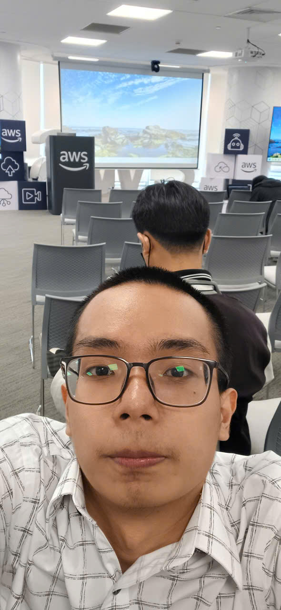

# Report on "Agentic AI Build Week"

### List of Speakers
#### Below is the list of teams who participated in the hackathon as speakers:

- **Team 3KA** -
- **One Team** 
- **Team Plan V**
- **Dream Team**

### Highlights
- With Team 3KA, I saw how the team handled time pressure and dealt with the problem of lacking specialized skills. 3KA didn't focus on problem-solving techniques or the latest architecture/technology; throughout the talk, the most memorable line I took away was: "Just try it — I don't have an AI background and went through a health and mental crisis, but our team still gave it a shot, because I'm still young."
- With OneTeam, I got an idea for an "AI for Everywhere" integration feature. The project is a ChatGPT-like workspace where McDonald's users can communicate with AWS Bedrock to place orders. The Zalo integration feature demoed felt very sleek and fresh for customers.   - The basic architecture takes input from Zalo, and channel adapters process it into standardized templates to communicate with Bedrock and return responses.   - However, in my personal assessment, this project relies heavily on the coding effort of building templates to communicate with Bedrock for CRUD operations on the order list, which requires a very high level of knowledge and effort — plus a large sample dataset if scaling to a big menu.   - The project could also be more cost-effective using open-source projects from Alibaba or DeepSeek, where the AI only needs to be specialized "just enough" and tokens are cheap.
- With Team PlanV, this project carries deep technical depth, building an AI to assist with architecture design for projects.   - Based on personal discussion, the workflow-based success of the project depends heavily on the "black box" (private policies or secret references).
- With Dreamteam, the group talked about how they managed the project, centered on 3 core points: clear goals, "working code is better than an unfinished project," and strong teamwork.

### Key Takeaways

#### Crisis-handling mindset

- Try breaking the problem down into sub-problems (this is the problem-solving mindset I've always tried to apply since my school days)
- Divide work reasonably
- Be clear, and set a plan toward the goal
- Track progress on the project's success

#### Confidence
- I felt this directly from how the speakers presented: "Showing up is already half of victory" - 3KA
- "Just try — register for every hackathon, because the biggest reward is your own participation"

#### OneTeam's idea for AI-on-everywhere integration:
- For my own workshop project, if I had more time, I would integrate "Knowledge Bases for Amazon Bedrock" to build a RAG chatbot

#### "AI's intelligence" depends on the input material:
- This is a personal observation based on analyzing the common thread across the 4 projects above — imagine AI as a human with a silicon brain: the more sufficient information you give it, the more knowledge, the more connections between knowledge (similar to how neurons work), the more effectively the AI performs.

### Some photos from the event

