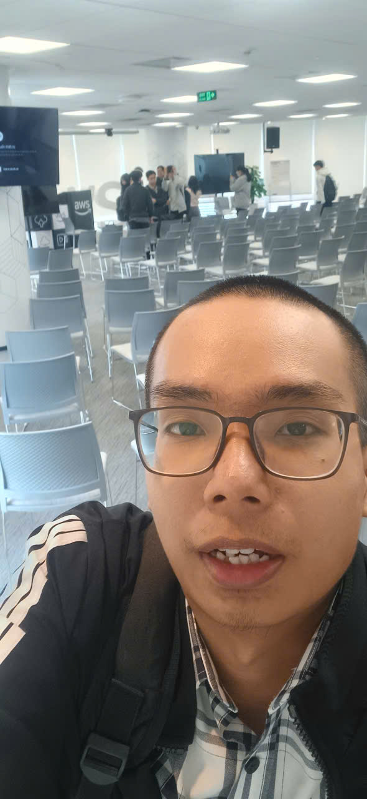

# Bài thu hoạch “

### Mục Đích Của Sự Kiện

- Chia sẻ best practices trong thiết kế ứng dụng hiện đại
- Giới thiệu phương pháp DDD và event-driven architecture
- Hướng dẫn lựa chọn compute services phù hợp
- Giới thiệu công cụ AI hỗ trợ development lifecycle

### Danh Sách Diễn Giả

- **Nguyễn Huỳnh Sơn**: Cựu SV HUFLIT, Dev tại Endava
- **Ngo Le Tan Huy** - FCAJ Admin
- **Thinh Nguyen** - FCAJ Admin

### Nội Dung Nổi Bật

#### SLA và điều phối SLA

- SLA: Service Level Agreement - là cam kết của đội kĩ thuật với khách hàng non-tech -> Là một phần quan trọng của quản lí dự án
- Kim tự tháp về điều phối một dự án:  UX (Trải nghiệm người dùng) -> Nghiệp vụ kinh doanh (khách hàng tổ chức) -> Ứng dụng ( Dev quản lí) -> Hạ tầng ( CPU - RAM, ... ) -> Nhà cung cấp dịch vụ Cloud ( AWS, GG Cloud, Asure )
- Điểm vàng của bài này chính là khẩu hiệu "Ứng dụng thường là phần fresher tập trung nhất và phình to nhất trong một kim tự tháp trong khi số 1 phải là UX"
- Trích dẫn lời khuyên của cựu CTO AWS: "Plan for failing as things fall all time"
- Trong quá trình thuyết trình, speaker Sơn có chia sẻ ví dụ một case điển hình: lỗi luôn xảy ra bất kì đâu, một update nhỏ dẫn đến sai số hệ thống. Dev phải có trách nhiệm hỗ trợ trong thời gian ngắn ( điều này chính speaker chia sẻ là áp lực nhất trong job cũ của anh ) 

#### Chuyển đổi sang kiến trúc ứng dụng mới - Microservice Architecture

Chuyển đổi thành hệ thống modular – từng chức năng là một **dịch vụ độc lập** giao tiếp với nhau qua **sự kiện** với 3 trụ cột cốt lõi:

- **Queue Management**: Xử lý tác vụ bất đồng bộ
- **Caching Strategy:** Tối ưu performance
- **Message Handling:** Giao tiếp linh hoạt giữa services

#### Domain-Driven Design (DDD)

- **Phương pháp 4 bước**: Xác định domain events → sắp xếp timeline → identify actors → xác định bounded contexts
- **Case study bookstore**: Minh họa cách áp dụng DDD thực tế
- **Context mapping**: 7 patterns tích hợp bounded contexts

#### Event-Driven Architecture

- **3 patterns tích hợp**: Publish/Subscribe, Point-to-point, Streaming
- **Lợi ích**: Loose coupling, scalability, resilience
- **So sánh sync vs async**: Hiểu rõ trade-offs (sự đánh đổi)

#### Compute Evolution

- **Shared Responsibility Model**: Từ EC2 → ECS → Fargate → Lambda
- **Serverless benefits**: No server management, auto-scaling, pay-for-value
- **Functions vs Containers**: Criteria lựa chọn phù hợp

#### Amazon Q Developer

- **SDLC automation**: Từ planning đến maintenance
- **Code transformation**: Java upgrade, .NET modernization
- **AWS Transform agents**: VMware, Mainframe, .NET migration

### Những Gì Học Được

#### Tư Duy Thiết Kế

- **Business-first approach**: Luôn bắt đầu từ business domain, không phải technology
- **Ubiquitous language**: Importance của common vocabulary giữa business và tech teams
- **Bounded contexts**: Cách identify và manage complexity trong large systems

#### Kiến Trúc Kỹ Thuật

- **Event storming technique**: Phương pháp thực tế để mô hình hóa quy trình kinh doanh
- Sử dụng **Event-driven communication** thay vì synchronous calls
- **Integration patterns**: Hiểu khi nào dùng sync, async, pub/sub, streaming
- **Compute spectrum**: Criteria chọn từ VM → containers → serverless

#### Chiến Lược Hiện Đại Hóa

- **Phased approach**: Không rush, phải có roadmap rõ ràng
- **7Rs framework**: Nhiều con đường khác nhau tùy thuộc vào đặc điểm của mỗi ứng dụng
- **ROI measurement**: Cost reduction + business agility

### Ứng Dụng Vào Công Việc

- **Áp dụng DDD** cho project hiện tại: Event storming sessions với business team
- **Refactor microservices**: Sử dụng bounded contexts để identify service boundaries
- **Implement event-driven patterns**: Thay thế một số sync calls bằng async messaging
- **Serverless adoption**: Pilot AWS Lambda cho một số use cases phù hợp
- **Try Amazon Q Developer**: Integrate vào development workflow để boost productivity

### Trải nghiệm trong event

Tham gia workshop **“GenAI-powered App-DB Modernization”** là một trải nghiệm rất bổ ích, giúp tôi có cái nhìn toàn diện về cách hiện đại hóa ứng dụng và cơ sở dữ liệu bằng các phương pháp và công cụ hiện đại. Một số trải nghiệm nổi bật:

#### Học hỏi từ các diễn giả có chuyên môn cao
- Các diễn giả đến từ AWS và các tổ chức công nghệ lớn đã chia sẻ **best practices** trong thiết kế ứng dụng hiện đại.
- Qua các case study thực tế, tôi hiểu rõ hơn cách áp dụng **Domain-Driven Design (DDD)** và **Event-Driven Architecture** vào các project lớn.

#### Trải nghiệm kỹ thuật thực tế
- Tham gia các phiên trình bày về **event storming** giúp tôi hình dung cách **mô hình hóa quy trình kinh doanh** thành các domain events.
- Học cách **phân tách microservices** và xác định **bounded contexts** để quản lý sự phức tạp của hệ thống lớn.
- Hiểu rõ trade-offs giữa **synchronous và asynchronous communication** cũng như các pattern tích hợp như **pub/sub, point-to-point, streaming**.

#### Ứng dụng công cụ hiện đại
- Trực tiếp tìm hiểu về **Amazon Q Developer**, công cụ AI hỗ trợ SDLC từ lập kế hoạch đến maintenance.
- Học cách **tự động hóa code transformation** và pilot serverless với **AWS Lambda**, từ đó nâng cao năng suất phát triển.

#### Kết nối và trao đổi
- Workshop tạo cơ hội trao đổi trực tiếp với các chuyên gia, đồng nghiệp và team business, giúp **nâng cao ngôn ngữ chung (ubiquitous language)** giữa business và tech.
- Qua các ví dụ thực tế, tôi nhận ra tầm quan trọng của **business-first approach**, luôn bắt đầu từ nhu cầu kinh doanh thay vì chỉ tập trung vào công nghệ.

#### Bài học rút ra
- Việc áp dụng DDD và event-driven patterns giúp giảm **coupling**, tăng **scalability** và **resilience** cho hệ thống.
- Chiến lược hiện đại hóa cần **phased approach** và đo lường **ROI**, không nên vội vàng chuyển đổi toàn bộ hệ thống.
- Các công cụ AI như Amazon Q Developer có thể **boost productivity** nếu được tích hợp vào workflow phát triển hiện tại.

#### Một số hình ảnh khi tham gia sự kiện

