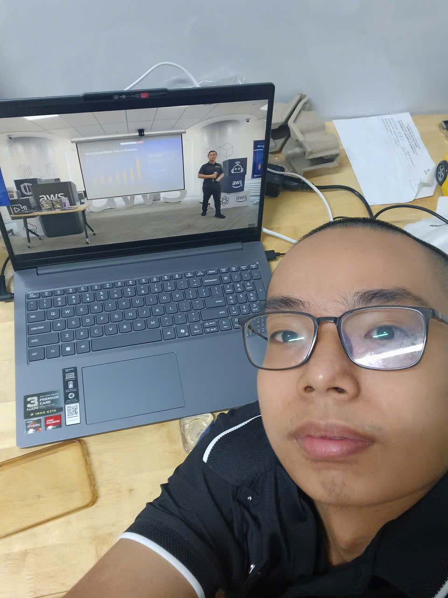

> Location: At home, Role: Participant

# Report 1: Career Opportunities in Cloud Computing in Vietnam

## Overview

The video presents a comprehensive perspective on the rapid growth of cloud computing in Vietnam, the changing job market, and career development strategies for students and professionals in Cloud and Data Engineering. Experts from AWS Vietnam, experienced Cloud/Data engineers, and community leaders share insights on current market demand, the impact of AI, and shifting skill requirements.

### Key Highlights

- 🚀 Cloud revenue in Vietnam grew 20x in six years, while traditional hardware spending dropped 10x.
- 🎯 Employers increasingly require interns/juniors to have practical knowledge of Kubernetes and cloud-native architecture.
- 🌐 AWS Vietnam is investing heavily in talent development, infrastructure, and long-term commitment, including building a Cloud Region and community programs.
- 🔍 Career success requires combining technical skills, ongoing visibility, and engagement within professional communities.
- 🤖 AI accelerates change, raising skill requirements and transforming job roles, but human understanding of business problems remains irreplaceable.
- 🔗 Referrals and community connections dominate IT hiring; public job postings are only a small part.
- 💡 Aligning technical skills with a specific industry (banking, retail, fintech, marketing) increases employability and impact.

### Key Topics in Detail

1. **The Irreversible Growth of Cloud:** "Cloud First" strategies are driving enterprises to move critical systems (core banking, booking, etc.) to AWS and similar platforms. This trend shrinks the traditional hardware market while sharply increasing demand for cloud services, opening career opportunities in Ho Chi Minh City, Hanoi, and Da Nang.

2. **Higher Hiring Bars for Entry-Level Roles:** Unlike before, companies now expect candidates — even interns — to have a solid foundation, certifications, and understanding of complex technologies like Kubernetes. Soft skills alone are no longer enough; candidates need hands-on technical competence and readiness to contribute immediately.

3. **Networking and Community as Career Catalysts:** Public job postings represent only a small fraction of actual opportunities. Most opportunities come through referrals within strong communities like AWS First Cloud AI Journey. Active participation, continuous learning, and building professional visibility are key to accessing this "hidden" job market.

4. **Combining Industry Knowledge with Technical Skills:** Success requires understanding the business context of a technical role. For example, being a "data engineer" in fintech requires understanding fraud-detection challenges specific to financial transactions. Projects/portfolios reflecting industry-specific problem-solving stand out far more than generic technical demos.

5. **AI — A Double-Edged Sword in Skill Development:** AI automates many coding and data tasks but cannot replace human judgment, problem framing, and business decision-making. Professionals need to learn to leverage AI to boost productivity while deepening their own understanding to validate AI outputs and guide strategy. Over-reliance on AI without understanding limits growth and job security.

6. **Bridging Academia and Real-World Practice:** Academic projects often fail to replicate the ambiguity, evolving requirements, and cross-team collaboration of real work environments. Students should seek internships, real projects, and use AI tools guided by practical frameworks like AWS best practices. A solid foundation (databases, programming, data structures, cloud basics) combined with communication and adaptability skills is essential.

7. **Persistence, Consistency, and Visibility Drive Career Progress:** Technical competence alone doesn't guarantee success. Career advancement depends on sustained effort, consistent community participation, effective communication with supervisors and cross-functional teams, and resilience in the face of setbacks. Visibility within professional networks correlates strongly with capability and career outcomes.

### Key Takeaways

1. **Cloud is an irreversible trend:** Demand for cloud talent in Vietnam is rising sharply, opening many opportunities but also raising technical requirements even at entry level.
2. **A solid foundation is a prerequisite:** Certifications and practical knowledge (Kubernetes, cloud-native architecture) matter more than ever, even for interns.
3. **The power of community and referrals:** Proactive networking and community engagement are the main path to job opportunities, rather than relying solely on public postings.
4. **Understand the industry alongside the tech:** Combining domain knowledge (fintech, banking, retail...) with technical skills creates a clear competitive edge.
5. **Use AI selectively:** AI boosts productivity but doesn't replace critical thinking and deep understanding; you need to master AI rather than depend on it entirely.
6. **Bridge the academia-industry gap:** Proactively seek real projects, internships, and build soft skills (communication, adaptability) to better prepare for the enterprise environment.
7. **Persistence and visibility are decisive long-term factors:** Career success comes not only from technical ability but also from persistence, consistency, and building a personal brand within the community.

# Report 2: FCAJ Community Day - June 27, 2026

## Overview

FC Community Day is a monthly event bringing together speakers from various companies to share practical experience. This session covered four topics: Cloud career paths, Vietnamese Voice AI, DevOps Automation, and AI-powered HR solutions.

### Key Highlights

- ☁️ **Steve Trần (Cloud Thinker):** A career transition into Cloud, emphasizing certifications and the continued strong demand for skilled Cloud engineers despite AI's rise.
- 🗣️ **Vietnamese Voice AI:** Regional accent diversity is a major challenge, requiring a multi-model architecture (STT + NLU + TTS) for effective deployment.
- 🤖 **Deop AI Agent:** Automates investigation and resolution of cloud infrastructure incidents through topology mapping and root-cause hypothesis testing, significantly reducing MTTD (mean time to detect).
- 💼 **Amazon Quick (Noventis):** An AI assistant that helps HR automate CV screening, reduce bias, and improve candidate matching with enterprise-grade security.
- 🔐 **Enterprise connection security:** Uses VPC endpoints and private DNS for secure connections between AI assistants and internal systems.
- ⚙️ **Multi-agent vs. Single-agent:** Multi-agent systems optimize specialized roles but add complexity; a well-designed single agent can still handle most tasks at lower cost/latency.
- 🎯 **Automated incident remediation:** Combines AI diagnosis with action frameworks (Kiro, Clot Code) to execute fixes, while still keeping human approval for critical steps.

### Key Topics in Detail

1. **Cloud Careers Amid the AI Wave:** Steve Trần spent four years going from studying for Azure certifications to earning AWS certifications, becoming a Solution Architect, and founding Cloud Thinker. The takeaway: companies need fewer but more skilled engineers who know how to work with AI rather than being replaced by it.

2. **Vietnamese Voice AI:** Vietnamese is a low-resource language with strong regional accent variation. The solution combines STT, NLU, and TTS with contextual processing (hesitation, voice gender) and real-time handling, plus handoff to human staff when needed in banking scenarios.

3. **Deop AI Agent in DevOps:** Learns context, classifies incidents, tests root-cause hypotheses, and suggests remediation. Automatically maps infrastructure and correlates distributed logs, cutting incident resolution time by up to 77%. Humans still supervise; AI only assists.

4. **Amazon Quick for HR:** Automatically parses unstructured CVs, matches skills to job descriptions, and ranks candidates. Integrates with enterprise ecosystems (Microsoft, Google, internal HR systems) while keeping data secure. Supports the process from candidate evaluation and interview scheduling to onboarding.

5. **Security for Enterprise AI System Integration:** Uses AWS VPC interface endpoints, private DNS, and restricted network paths to prevent data exposure over the public internet. Authentication, encryption, and compliance with organizational policy ensure data integrity.

6. **Multi-agent vs. Single-agent Architecture:** Multi-agent reduces communication overhead and enables fine-grained role control but adds development/maintenance complexity. A well-designed single agent can handle most tasks at lower cost and latency. The choice depends on the specific workload.

7. **Automated Remediation via AI Action Extensions:** Beyond detection and diagnosis, integration with action platforms (Kiro, Clot Code) enables automatic or semi-automatic remediation (e.g., restarting a service), while still requiring human approval for critical actions.

### Core Technology Summary Table

| Technology / Tool | Domain | Key Functions | Benefits | Deployment Notes |
|---|---|---|---|---|
| Cloud Thinker | Cloud Operations | Infrastructure management, incident investigation | Reduces operational complexity, boosts productivity | Supports large/legacy enterprise systems |
| Voice AI (Renova R AI) | Voice Interfaces | STT, TTS, contextual understanding, multi-model | Vietnamese voice bots handling multiple accents | Real-time streaming, human handoff |
| Deop AI Agent | DevOps & SRE | Incident detection, hypothesis testing, remediation suggestions | 70-77% reduction in incident resolution time | Requires mature observability/logging |
| Amazon Quick | HR & Enterprise AI | CV analysis, talent analytics, workflow automation | Speeds up recruitment, improves candidate fit | Supports VPC connectivity, customizable |
| MCP Server & VPC Connectivity | Security & Networking | Private connectivity between AI agents and backend systems | Security compliance, reduced attack surface | Uses VPC interface endpoint and private DNS |
| Multi-Agent Architecture | AI Architecture | Role-specialized agents that communicate with each other | Role-based control, optimized performance | More maintenance complexity than single-agent |
| AI Action Extensions | Automation Framework | Automatically executes remediation based on AI diagnosis | Faster recovery, less manual intervention | Human approval recommended for critical actions |

### Key Takeaways

1. **Balancing human and AI skills:** Cloud careers remain valuable when engineers know how to combine expertise with AI tools rather than being replaced.
2. **Language-specific challenges:** Building Voice AI for a low-resource language like Vietnamese requires a multi-component architecture and sophisticated context handling.
3. **AI assists operations, doesn't replace people:** Deop AI Agent shows AI can speed up diagnosis/remediation but still needs engineer oversight.
4. **Responsible HR automation:** Amazon Quick shows AI can reduce bias and improve hiring efficiency when properly integrated with enterprise security.
5. **Security is foundational for AI integration:** Private connectivity (VPC, private DNS) is a must when AI accesses internal systems.
6. **Choose the right agent architecture for the problem:** There's no single "correct" architecture between multi-agent and single-agent; the decision depends on the specific workload and acceptable complexity.
7. **Human-in-the-loop remains critical:** Even as AI can propose and execute automated fixes, human approval is still needed for critical actions.

# Report 3: AWS Agent Core - Summary (August 1, 2026)

## 1. Three-Layer Architecture

**Runtime Environment**
- Serverless, pay-as-you-go
- Strand SDK or container (Docker/S3)
- Isolation via Firecracker MicroVM
- Bidirectional streaming, asynchronous multi-agent

**Identity Layer**
- Controls Inbound (who can call the Agent) / Outbound (what the Agent can call)
- JWT, OAuth 2.0, Cognito, Workload Access Tokens (WAT)
- IAM-style permissions (Allow/Deny)

**Gateway Layer**
- Middleware: tool management, security, routing
- Semantic Discovery: automatically selects the right tool
- Interceptors hide sensitive data + Human-in-the-loop

## 2. Development Process

Design/PoC → Model Selection → Development (Strand SDK/container) → Identity & Gateway configuration → Deployment (ARN versioning, rollback) → Monitoring (CloudWatch)

**Protocols:** HTTP API (web/mobile) · MCP (Agent-Tool) · A2A (Agent-Agent) · Agent-to-User (streaming)

## 3. Security & Networking

- Connectivity: Public / Hybrid / Private
- AWS PrivateLink: private connectivity between VPC and AWS
- Audit logging: records all authorization activity, usage, and human interventions

## 4. Key Takeaways

1. Shift in thinking from static workflows to autonomous multi-agent systems
2. Enterprise security: WAT, Inbound/Outbound permissions, PrivateLink
3. Standardized production deployment process with versioning & rollback
4. Balancing automation and control through Human-in-the-loop

#### Photos from the Event

